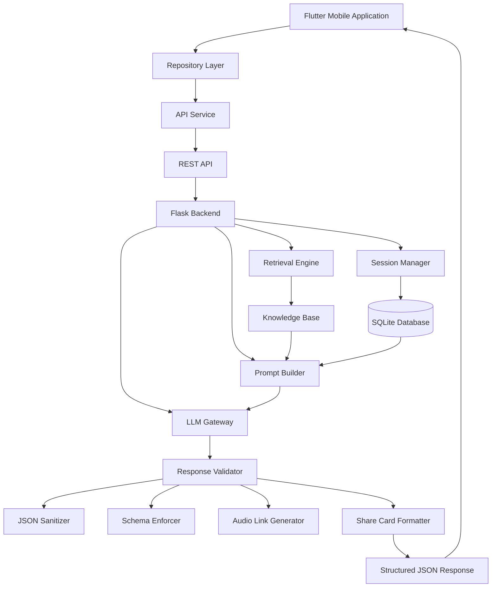

# 🧠 Hakim

### AI-Powered Quranic Intelligence Platform

A modern AI-powered platform that transforms Quranic verses into structured knowledge,
semantic understanding, and practical life guidance through an intelligent multi-stage reasoning pipeline.

---

---

🚀 **Flutter Mobile App**

•

🧠 **AI Powered Backend**

•

📖 **Quran Intelligence**

•

🎨 **Premium Share Cards**

•

🎙 **Voice Interaction**

•

⚡ **REST API**

---

⭐ Intelligent Quran Analysis

⭐ Lightweight Retrieval Engine

⭐ AI Prompt Engineering

⭐ Structured JSON Responses

⭐ Premium Mobile Experience

⭐ Share Card Generator

⭐ Speech-to-Text Pipeline

⭐ Session Memory

⭐ SQLite Persistence

⭐ Production Ready Architecture

---

# ✨ What is Hakim?

Hakim is a **full-stack AI-powered Quranic intelligence platform** designed to deliver rich, structured, and context-aware analysis of Quranic verses through a modern mobile experience.

Unlike conventional chatbot applications, Hakim combines a dedicated retrieval layer, prompt engineering, response validation, and semantic post-processing into a unified AI pipeline that produces reliable, structured, and visually optimized responses.

The platform has been engineered with scalability, maintainability, and mobile performance as primary objectives while keeping the architecture lightweight enough to run efficiently on low-resource hosting environments.

---

## 🚀 Highlights

✔ AI-first Software Engineering

✔ Flutter + Python Full Stack

✔ Lightweight Retrieval Architecture

✔ Context-Aware AI Responses

✔ Smart JSON Validation Layer

✔ Dynamic Share Card Engine

✔ Premium Mobile UI

✔ RESTful API

✔ SQLite Session Management

✔ Production Deployment on Linux & cPanel

---

## 📸 Preview

> Screenshots and demo GIFs will be added soon.

---
# 🌍 Overview

**Hakim** is a modern **AI-powered Quranic Intelligence Platform** designed to bridge the gap between traditional Quranic study and contemporary Artificial Intelligence technologies.

Rather than functioning as a conventional chatbot that simply generates text, Hakim implements a structured multi-stage processing pipeline capable of retrieving contextual information, constructing optimized prompts, validating AI responses, and delivering a consistent output format specifically designed for mobile applications.

The project combines a Flutter-based mobile client with a Python (Flask) backend to create a scalable, maintainable, and production-oriented architecture. Every response passes through several processing stages before reaching the end user, ensuring consistency, reliability, and compatibility with the application's interface.

---

# 🏗 System Architecture

Hakim follows a layered architecture that separates presentation, application logic, retrieval, AI communication, and response processing into independent components.

This separation improves maintainability, scalability, testing, and future extensibility while keeping the mobile application lightweight and responsive.

---

# High-Level Architecture

---

# Request Lifecycle

Every user request follows a deterministic processing pipeline.

## Step 1 — User Interaction

The user submits a question from the Flutter application.

The application packages:

* User message
* Session identifier
* Previous conversation (when required)

and sends them to the backend through a REST API.

---

## Step 2 — Context Retrieval

Before contacting the language model, the backend searches its local knowledge base.

The retrieval layer identifies the most relevant information and prepares contextual documents that can improve response quality.

This stage minimizes hallucinations while increasing response consistency.

---

## Step 3 — Prompt Construction

The backend combines:

* User request
* Conversation history
* Retrieved knowledge
* System instructions
* Output schema

into a single optimized prompt.

This guarantees that the language model receives structured and complete instructions.

---

## Step 4 — AI Processing

The prompt is forwarded to the configured LLM provider.

The architecture is intentionally model-agnostic and can communicate with any compatible AI service through a REST interface.

This design allows future migration between providers without major architectural changes.

---

## Step 5 — Response Validation

Raw LLM output is never returned directly.

Instead, Hakim validates every response by:

* repairing malformed JSON,
* removing markdown wrappers,
* validating mandatory fields,
* checking schema consistency,
* normalizing output,
* generating audio metadata,
* preparing share-card content.

This significantly improves frontend reliability.

---

## Step 6 — Mobile Rendering

Finally, the backend returns a structured JSON object.

Flutter converts the response into rich widgets, interactive cards, shareable layouts, and formatted content without additional parsing logic.

---

# Architectural Layers

## Mobile Layer

Responsibilities include:

* User Interface
* Navigation
* State Management
* Share Cards
* Voice Interaction
* Local User Experience

Technologies:

* Flutter
* Dart
* GetX

---

## API Layer

Responsible for:

* HTTP communication
* Authentication
* Request validation
* Error handling
* Serialization

---

## Application Layer

Implements the project's business logic.

Responsibilities include:

* Session management
* Context orchestration
* Prompt generation
* Request routing
* Response processing

---

## Retrieval Layer

The retrieval engine enriches prompts with contextual information before they are sent to the language model.

Current implementation is based on:

* TF-IDF scoring
* Inverted Index
* Chunk retrieval
* Phrase matching

The architecture allows future migration to embedding-based retrieval engines if required.

---

## AI Layer

The AI layer is responsible for semantic reasoning.

Responsibilities include:

* Context interpretation
* Structured response generation
* Quranic analysis
* Practical recommendations

The backend isolates AI communication from the rest of the system, making provider replacement straightforward.

---

## Persistence Layer

Conversation history is stored using SQLite.

The persistence layer provides:

* Session isolation
* Historical conversations
* Lightweight storage
* Efficient local deployment

---

# Design Goals

The architecture was designed to satisfy several engineering objectives:

* Clean separation of responsibilities
* Predictable data flow
* Reliable mobile integration
* AI provider independence
* Lightweight deployment
* Easy maintainability
* Future scalability
* Production-oriented organization

---

# Engineering Philosophy

Hakim treats Artificial Intelligence as one component within a larger software ecosystem.

Instead of relying exclusively on an LLM, the platform combines classical software engineering techniques—including retrieval, validation, structured APIs, persistence, and deterministic processing—to produce responses that are reliable enough for integration into a production mobile application.

This layered approach improves robustness, simplifies frontend development, and creates a foundation that can evolve as AI technologies continue to advance.

---
# 🎯 Project Vision

The primary goal of Hakim is not merely to answer questions about Quranic verses, but to transform AI-generated responses into structured knowledge that users can easily understand, explore, and apply in their daily lives.

The platform emphasizes:

* Accurate contextual understanding
* Consistent response formatting
* Mobile-first user experience
* Fast response generation
* Maintainable backend architecture
* Extensible AI workflow

---

# 💡 Why Hakim?

Modern Large Language Models are powerful, but they present several challenges when building production applications:

* Responses may be inconsistent.
* JSON outputs are often malformed.
* Context can be lost during long conversations.
* Mobile interfaces require predictable data structures.
* Raw AI responses are difficult to integrate directly into applications.

Hakim addresses these challenges by introducing a structured processing pipeline between the language model and the mobile client.

Instead of sending raw model responses directly to the application, every response is validated, normalized, and transformed into a predictable schema before reaching the user.

This significantly improves reliability, simplifies frontend development, and creates a more stable user experience.

---

# 🧩 Core Design Principles

The project is built around several engineering principles:

## Separation of Concerns

Each component has a single responsibility.

* Flutter handles presentation.
* Flask manages application logic.
* Retrieval prepares contextual information.
* The language model performs reasoning.
* Post-processing validates the output.

This modular architecture simplifies maintenance and future development.

---

## Mobile-First Architecture

Hakim was designed primarily for mobile devices.

The backend generates responses specifically tailored to Flutter widgets instead of generic paragraphs.

This allows the application to present structured cards, summaries, action points, and shareable content without additional client-side parsing.

---

## AI-Centric Workflow

Artificial Intelligence is treated as one component within a larger software system—not as the system itself.

Instead of relying entirely on the language model, Hakim combines:

* Context retrieval
* Prompt engineering
* Response validation
* Business logic
* Output formatting

to produce predictable and application-ready results.

---

## Lightweight Infrastructure

The backend intentionally avoids unnecessary complexity.

Rather than requiring expensive cloud infrastructure or vector databases, Hakim focuses on lightweight technologies capable of running efficiently on shared hosting environments.

This makes deployment significantly easier while maintaining excellent performance for the project's current scope.

---

# 🚀 Key Objectives

Hakim was developed with the following objectives:

* Build a production-ready Flutter application.
* Design a maintainable Python backend.
* Create a structured AI interaction pipeline.
* Improve response consistency.
* Support long-term extensibility.
* Deliver an intuitive mobile experience.
* Demonstrate practical AI-assisted software engineering.

---

# 📌 Project Scope

Hakim is not intended to replace traditional Quranic scholarship or classical exegesis.

Instead, it serves as an intelligent software platform that assists users in exploring Quranic concepts through modern AI technologies while maintaining a structured and user-friendly interface.

The project represents the intersection of mobile development, backend engineering, information retrieval, and AI-assisted application design.

---

> **Developer Note**

> Hakim is both a software engineering project and an exploration of how modern AI can be integrated into production-grade applications. The emphasis is placed not only on generating intelligent responses but also on building the engineering infrastructure required to make those responses reliable, maintainable, and useful in real-world mobile software.
