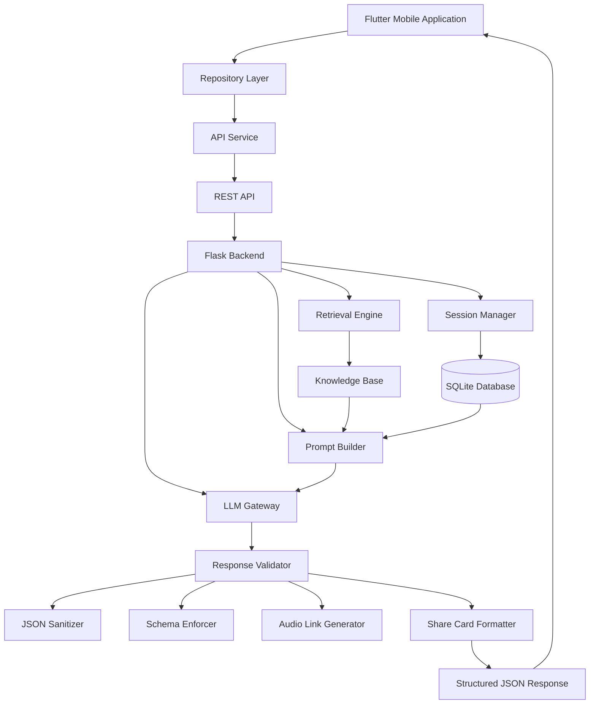

<p align="center">
  <h1 align="center">🧠 Hakim</h1>
  <p align="center"><strong>AI-Powered Quranic Intelligence Platform</strong></p>
  <p align="center">
    A modern platform that transforms Quranic verses into structured knowledge, semantic understanding, and practical life guidance through an intelligent multi-stage reasoning pipeline.
  </p>
</p>

<p align="center">
  
  
  
  
  
  
</p>

---

## ✨ What is Hakim?

Hakim is a **full-stack AI-powered Quranic intelligence platform** designed to bridge the gap between traditional Quranic study and contemporary Artificial Intelligence technologies. 

Rather than functioning as a conventional chatbot that simply generates raw text, Hakim implements a structured multi-stage processing pipeline. It retrieves contextual information, constructs optimized prompts, validates AI responses, and delivers a consistent output format specifically tailored for a premium mobile experience.

## 🤖 AI-Assisted Development

This project serves as a practical demonstration of modern AI-first software engineering. **Approximately 90% of the codebase and implementation was developed with the assistance of AI tools.** 

Through an iterative collaboration between the developer and AI, these tools actively contributed to Flutter UI generation, backend Python logic, REST API structuring, prompt engineering, and complex JSON validation layers. The developer retained full architectural control, guiding the system's design, ensuring security, and making all final engineering decisions.

## 🚀 Key Features

* **Intelligent Quran Analysis:** Semantic verse interpretation, spiritual reflections, and practical life guidance.
* **Premium Share Cards:** Generate beautiful, dynamic, high-resolution shareable content directly from AI responses.
* **Smart JSON Validation Layer:** Ensures LLM outputs are perfectly structured for the mobile UI to prevent rendering errors.
* **Lightweight Retrieval Engine:** A built-in TF-IDF scoring and inverted index system to enrich AI prompts with accurate context.
* **Voice Interaction:** Integrated speech-to-text pipeline for natural conversations.
* **Session Memory:** Persistent conversation history managed locally via SQLite.
* **Production-Ready Architecture:** Clean separation of frontend and backend, capable of running efficiently on shared Linux/cPanel environments.

---

## 🏗 System Architecture

Hakim follows a layered architecture that separates presentation, application logic, retrieval, AI communication, and response processing. This separation improves maintainability, testing, and future extensibility.


---

## 📂 Project Structure

```text
hakim/
│
├── frontend/
│   ├── lib/
│   │   ├── models/
│   │   ├── repositories/
│   │   ├── services/
│   │   ├── utils/
│   │   ├── viewmodels/
│   │   ├── views/
│   │   └── main.dart
│   │
│   ├── assets/
│   └── pubspec.yaml
│
├── backend/
│   ├── app.py
│   ├── passenger_wsgi.py
│   ├── requirements.txt
│   ├── knowledge.txt
│   └── database/
│
├── docs/
│   └── screenshots/
│
└── README.md
```

---

## 🛠 Tech Stack

### Frontend

* Flutter
* Dart
* GetX
* Screenshot
* Share Plus

### Backend

* Python
* Flask
* SQLite
* Flask-CORS
* dotenv

### Infrastructure

* Linux (Ubuntu)
* cPanel Deployment
* REST API Architecture

---

## 🚀 Installation

### Clone Repository

```bash
git clone https://github.com/amirkhodaei1/smart_chat_bot.git

cd smart_chat_bot
```

### Flutter Setup

```bash
flutter pub get

flutter run
```

### Backend Setup

```bash
cd backend

pip install -r requirements.txt

python app.py
```

---

## ⚙ Environment Variables

Create a `.env` file inside the backend directory:

```env
API_KEY=YOUR_API_KEY
MODEL_NAME=YOUR_MODEL
BASE_URL=YOUR_ENDPOINT
```

---

## 🎯 Design Goals

* Fast and responsive user experience
* Maintainable architecture
* AI-first workflow
* Clean separation of frontend and backend
* Production-ready deployment
* Extensible codebase

---

## 🔮 Roadmap

* Advanced Quran Search
* Verse Cross-Referencing
* Multi-Model AI Support
* User Accounts
* Cloud Synchronization
* Voice Conversations
* Offline Mode
* Enhanced Share Templates

---

## 🤝 Contributing

Contributions, feature requests, and bug reports are welcome.

Feel free to open an issue or submit a pull request.

---

## 📜 License

This project is licensed under the MIT License.

---

<p align="center">
<b>Hakim</b><br>
Where Artificial Intelligence Meets Quranic Wisdom.
</p>

